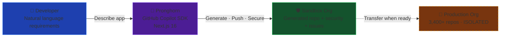

# 🦌 Pronghorn — AI-Powered Enterprise Application Generator


**Built with the [GitHub Copilot SDK](https://github.com/github/copilot-sdk) · FY26 MCAPS Enterprise Challenge**

> Pronghorn takes natural language requirements, generates enterprise-ready code, pushes it to a sandboxed GitHub org, and locks down security — all without touching production repos. Built for the Government of Alberta's enterprise modernization. The implementation here is the enterprise ready ready version using the GHCP SDK rather than their original implementation using a shoe string set of startupy technologies which resulted in very high maintainence costs of the apps, and lack of guardrails, security, data residency requirements, and so forth.

[](https://github.com/github/copilot-sdk)
[](https://nextjs.org)
[](https://azure.microsoft.com/products/container-apps)
[](https://www.typescriptlang.org)

🎬 **[Watch the demo video](https://microsoft-my.sharepoint.com/:v:/p/sharmave/IQAX6G22dasLT5Kl9K4vrZwnATDoaX8ZSH1XM-AzUX0aJdU?e=VV7qXF&nav=eyJyZWZlcnJhbEluZm8iOnsicmVmZXJyYWxBcHAiOiJTdHJlYW1XZWJBcHAiLCJyZWZlcnJhbFZpZXciOiJTaGFyZURpYWxvZy1MaW5rIiwicmVmZXJyYWxBcHBQbGF0Zm9ybSI6IldlYiIsInJlZmVycmFsTW9kZSI6InZpZXcifX0%3D)** — 3-min walkthrough of Pronghorn in action

---

## FY26 Challenge Submission

**Summary (150 words):**

> Pronghorn is an AI-powered enterprise application generator built with the GitHub Copilot SDK for the Government of Alberta. The original prototype relied on a startup stack — Lovable, Supabase, Render.com, with hand-rolled agent orchestration via direct Gemini/Claude API calls — creating data sovereignty, security, and governance risks unacceptable for a public-sector organization managing 3,400+ repositories. Pronghorn replaces this with an enterprise-grade, Azure-native architecture: the GitHub Copilot SDK provides managed agent orchestration with encrypted content, a sandbox GitHub organization isolates all AI-generated code from production repos (zero blast radius), and every generated project ships with Azure Bicep IaC, GitHub Actions CI/CD, Dependabot alerts, branch protection, and automated security fixes from day one. The Copilot SDK decomposes requirements into GitHub Issues labeled for Copilot coding agent assignment, while 8 specialized Copilot agents provide domain expertise across API design, security, infrastructure, SRE, data governance, and accessibility.

**Business Value:**

- **Minutes** instead of days to scaffold enterprise-grade projects
- **Zero blast radius** — sandbox org isolation from 3,400+ production repos
- **Security from day one** — GHAS, Dependabot, branch protection, automated fixes
- **Managed orchestration** — Copilot SDK replaces hand-rolled LLM prompt chains
- **Azure-native** — Canadian data residency, Managed Identity, Key Vault
- **Reusable pattern** — sandbox org architecture works for any enterprise

---

## Why This Exists

GovAlta manages **3,400+ repos** (growing to 7,000+). Their original Pronghorn prototype was duct-taped together with startup tools:

- **Lovable** for the frontend (no source control, no CI/CD)
- **Supabase** for the database (data outside Canada)
- **Render.com** for hosting (no enterprise SLA)
- **Direct Google Gemini & Anthropic Claude API calls** for AI (data leaving the org boundary, zero audit trail)
- **Hand-rolled agent orchestration** — raw LLM prompt chaining with no framework, no error handling, no observability

This worked for a prototype. It's completely unacceptable for a government org with data residency requirements, 3,400 production repos, and real compliance obligations.

### What We Replaced It With

| Layer             | Was                         | Now                                                                   |
| ----------------- | --------------------------- | --------------------------------------------------------------------- |
| **AI**            | Raw Gemini/Claude API calls | **GitHub Copilot SDK** — managed, encrypted, auditable                |
| **Agents**        | Hand-rolled prompt chains   | **Copilot SDK sessions** — streaming, tool use, error handling        |
| **Blast Radius**  | AI had access to everything | **Sandbox org** — generated repos completely isolated from production |
| **Hosting**       | Render.com                  | **Azure Container Apps** — Canada Central, enterprise SLA             |
| **Database**      | Supabase (US-hosted)        | **Stateless** + Azure Key Vault for secrets                           |
| **Security**      | Manual, ad-hoc              | **GHAS + Dependabot + branch protection** — automated from day one    |
| **Identity**      | API keys, personal tokens   | **Azure Entra ID**, Managed Identity, DefaultAzureCredential          |
| **IaC**           | None                        | **Azure Bicep** + `azd up`                                            |
| **CI/CD**         | None                        | **GitHub Actions** → Azure (OIDC, no stored secrets)                  |
| **Observability** | None                        | **App Insights + Log Analytics**                                      |

---

## How It Works



The generation pipeline runs 7 stages via SSE:

1. Scaffold 38+ enterprise files (TypeScript, Bicep, Docker, GitHub Actions)
2. Create repo in sandbox org
3. Push code via Git tree API
4. Configure branch protection + Dependabot + automated security fixes
5. Use Copilot SDK to decompose requirements into 4–8 GitHub Issues
6. Create issues with `copilot-agent` labels (ready for Copilot agent assignment)
7. Done — repo URL, file count, security status returned

> 📐 Detailed diagrams: [`docs/full-end-to-end-architecture.mmd`](docs/full-end-to-end-architecture.mmd) · [`docs/legacy-customer-architecture.mmd`](docs/legacy-customer-architecture.mmd) · [`docs/simple-architecture-deck-slide.mmd`](docs/simple-architecture-deck-slide.mmd)

---

## Screenshots


#### Home View 🏠


#### Requirements Chat 🗨️


#### Pre-App Generation ⌛


#### Landing zone App Generation In-Progress


#### Landing Zone App Generated! ✅


#### Generated Landing Zone App Repo on GitHub ✅


#### Generated Issues on GitHub ✅


#### Generated Single Issue on GitHub ✅


#### Custom Pronghorn 🐐 Agents - Assignable to issues ✅


---

## Copilot Agents

8 specialized agents in `.github/agents/`:

| Agent                        | What it does                                         |
| ---------------------------- | ---------------------------------------------------- |
| `pronghorn-api` 🔌           | API design, OpenAPI specs, Express middleware        |
| `pronghorn-security` 🔒      | FOIP compliance, OWASP, Entra ID, Key Vault          |
| `pronghorn-terraform` 🏗️     | Azure Bicep/Terraform, `azd` templates               |
| `pronghorn-ticketing` 🎫     | GitHub Issues, project boards, sprint planning       |
| `pronghorn-sre` 📊           | Azure Monitor, App Insights, SLOs, incident response |
| `pronghorn-docs` 📝          | READMEs, ADRs, runbooks, API docs                    |
| `pronghorn-data` 📊          | Data governance, FOIP, Canadian data residency       |
| `pronghorn-accessibility` ♿ | WCAG 2.1 AA, screen readers, keyboard nav            |

---

## Tech Stack

| Layer      | Tech                                               |
| ---------- | -------------------------------------------------- |
| Framework  | Next.js 16 (App Router, standalone)                |
| UI         | shadcn/ui + Tailwind CSS 4                         |
| AI         | GitHub Copilot SDK (`@github/copilot-sdk` v0.1.25) |
| GitHub API | Octokit (`@octokit/rest`)                          |
| Language   | TypeScript 5 / React 19                            |
| Hosting    | Azure Container Apps                               |
| IaC        | Azure Bicep                                        |
| CI/CD      | GitHub Actions + `azd`                             |

---

## Quick Start

```bash
# Clone & install
git clone https://github.com/VeVarunSharma/project-pronghorn-fy26-github-copilot-sdk-challenge.git
cd project-pronghorn-fy26-github-copilot-sdk-challenge
pnpm install

# Set up auth
gh auth login && gh auth refresh --scopes copilot
cp .env.example .env.local
# Edit .env.local: set GITHUB_TOKEN and PRONGHORN_SANDBOX_ORG

# Run
pnpm dev  # http://localhost:3000
```

### Deploy to Azure

```bash
azd auth login && azd up
```

Provisions: Container App + Container Registry + Key Vault + App Insights. The `preprovision` hook grabs your `GITHUB_TOKEN` from `gh` CLI automatically.

---

## API

| Method | Path                      | What it does                        |
| ------ | ------------------------- | ----------------------------------- |
| `GET`  | `/api/health`             | Health check                        |
| `GET`  | `/api/pronghorn/status`   | Service status (sandbox org, token) |
| `POST` | `/api/chat`               | Requirements chat (SSE streaming)   |
| `POST` | `/api/pronghorn/generate` | Full generation pipeline (SSE)      |

---

## Environment Variables

| Variable                 | Required | What                                                       |
| ------------------------ | -------- | ---------------------------------------------------------- |
| `GITHUB_TOKEN`           | Yes      | Copilot SDK auth (needs `copilot` scope)                   |
| `PRONGHORN_SANDBOX_ORG`  | Yes      | GitHub org for generated repos                             |
| `PRONGHORN_GITHUB_TOKEN` | No       | Separate PAT for GitHub API (falls back to `GITHUB_TOKEN`) |
| `MODEL_PROVIDER`         | No       | `azure` for BYOM                                           |
| `MODEL_NAME`             | No       | e.g. `o4-mini`, `gpt-5`                                    |
| `AZURE_OPENAI_ENDPOINT`  | No       | Required with `MODEL_PROVIDER=azure`                       |

---

## Model Configuration

| Config          | How                                       | Effect                           |
| --------------- | ----------------------------------------- | -------------------------------- |
| GitHub Default  | No env vars needed                        | Uses GitHub-hosted models        |
| GitHub Specific | `MODEL_NAME=o4-mini`                      | Picks a specific GitHub model    |
| Azure BYOM      | `MODEL_PROVIDER=azure` + endpoint + model | Your own Azure OpenAI deployment |

Supported models: `o3`, `o4-mini`, `gpt-5` family, `codex-mini`

---

## Project Structure

```
src/app/                    → Next.js 16 App Router (pages + API routes)
src/app/api/chat/           → POST /api/chat (requirements agent, SSE)
src/app/api/pronghorn/      → POST /api/pronghorn/generate (7-stage pipeline, SSE)
src/components/             → Chat window, generate panel, shadcn/ui primitives
src/lib/                    → Copilot client, model config, GitHub service, utils
.github/agents/             → 8 Copilot agents
.github/workflows/          → CI/CD (azure-dev.yml)
infra/                      → Azure Bicep (Container App, ACR, Key Vault, monitoring)
scripts/                    → azd hooks (get-github-token.mjs)
docs/                       → Architecture diagrams (Mermaid .mmd files)
```

---

## Planned: Microsoft Work-IQ Integration

> Work-IQ is in [Public Preview](https://github.com/microsoft/work-iq) (v0.2.8)

The idea: when a developer signs in with their M365 account, [Work-IQ](https://github.com/microsoft/work-iq) pulls context from their emails, meetings, Teams messages, and documents to enrich the requirements chat. It's an MCP server — same as the GitHub MCP we already use — so architecturally it slots right in.

Not implemented yet (the app is stable as-is), but the wiring is straightforward: add Work-IQ to `mcp.json`, add MSAL sign-in, inject M365 context into prompts. See the [full architecture diagram](docs/full-end-to-end-architecture.mmd) where it's shown with dashed lines.

---

## Responsible AI

- **Transparency** — All generated repos are marked "Generated by Pronghorn". System prompts are in `AGENTS.md`.
- **Human oversight** — Sandbox org requires human review before promotion to production. Branch protection enforces reviews.
- **Security** — Blast radius isolation. Dependabot + automated fixes. No secrets in generated code. Non-root Docker.
- **Privacy** — No user data stored beyond session. Scoped tokens with minimum permissions.
- **Limitations** — AI-generated code should always be reviewed. Complex architecture decisions need human architects.

---

| Task    | Command        |
| ------- | -------------- |
| Install | `pnpm install` |
| Dev     | `pnpm dev`     |
| Build   | `pnpm build`   |
| Start   | `pnpm start`   |
| Lint    | `pnpm lint`    |
| Deploy  | `azd up`       |

---

<p align="center">
  Built with the <a href="https://github.com/github/copilot-sdk">GitHub Copilot SDK</a> · GovAlta Enterprise Pattern · Sandbox Org Isolation
</p>
