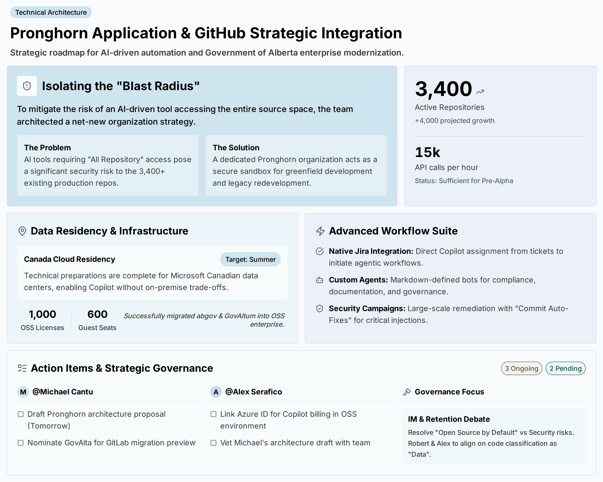
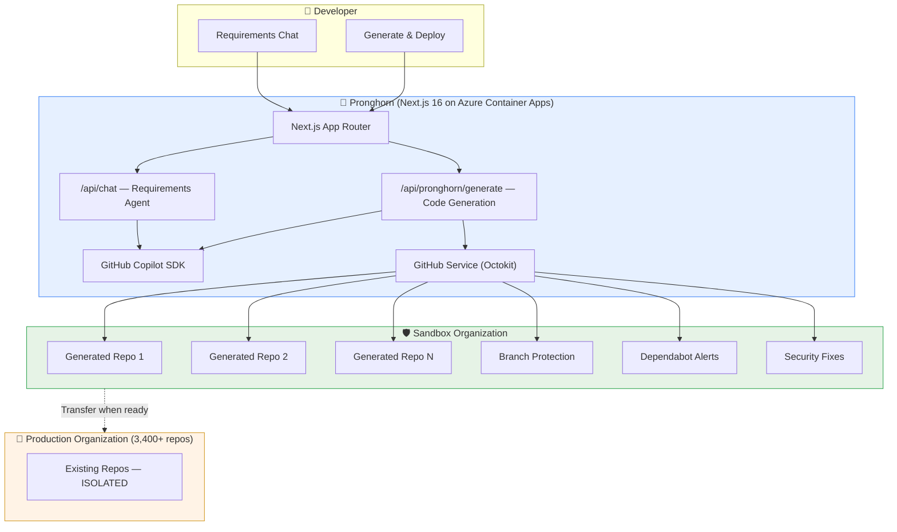

# 🦌 Pronghorn — AI-Powered Enterprise Application Generator

**Built with the [GitHub Copilot SDK](https://github.com/github/copilot-sdk) · FY26 MCAPS Enterprise Challenge**

> Pronghorn automates greenfield application generation for enterprises. Using the GitHub Copilot SDK's agentic capabilities, it takes natural language requirements, generates production-ready code, provisions repositories in a sandboxed GitHub organization, and enforces security policies — all without touching existing production repos. Built for the Government of Alberta's enterprise modernization initiative.

[](https://github.com/github/copilot-sdk)
[](https://nextjs.org)
[](https://azure.microsoft.com/products/container-apps)
[](https://www.typescriptlang.org)



---

## 📋 Table of Contents

- [Problem → Solution](#problem--solution)
- [Demo](#demo)
- [Architecture](#architecture)
- [Features](#features)
- [Copilot Agents](#copilot-agents)
- [Tech Stack](#tech-stack)
- [Prerequisites](#prerequisites)
- [Setup](#setup)
- [Deployment](#deployment)
- [API Endpoints](#api-endpoints)
- [Environment Variables](#environment-variables)
- [Project Structure](#project-structure)
- [Model Configuration](#model-configuration)
- [Customer Context](#customer-context)
- [Responsible AI (RAI)](#responsible-ai-rai)
- [Challenge Submission](#fy26-github-copilot-sdk-enterprise-challenge)

---

## Problem → Solution

### The Problem

Enterprise organizations managing thousands of repositories (3,400+ in GovAlta's case, with 4,000+ projected growth) face a critical challenge: **AI-driven development tools require broad repository access**, creating an unacceptable "blast radius" where a bug or misconfiguration could affect the entire source code estate.

**The original Pronghorn prototype** was built on a shoestring stack of startup-oriented technologies that are unsuitable for enterprise use:

**Legacy Flow** *(see [`docs/legacy-customer-architecture.mmd`](docs/legacy-customer-architecture.mmd) for diagram)*:
> 💡 Idea → 🎯 Requirements Mode (AI decomposes into Epics → Features → User Stories) → 🎨 Canvas / Design Mode (React Flow canvas, 24+ node types, 10 AI agent specialists sharing a "blackboard") → 🔍 Audit Mode (multi-agent cross-comparison with Venn diagrams, evidence grids, knowledge graphs) → 💻 Build Mode (autonomous coding agent with stage/commit/push) → 🚀 Deploy Mode (push to Render.com, provision Supabase PostgreSQL)

All of this was powered by **hand-rolled agent orchestration** making direct API calls to Google Gemini and Anthropic Claude public endpoints, with the UI generated via Lovable:

| Layer | Original (Startup Stack) | Enterprise Concern |
|-------|--------------------------|-------------------|
| **AI / LLMs** | Direct API calls to Google Gemini & Anthropic Claude public endpoints | No enterprise SLA, data leaves org boundary, no audit trail, usage not governed |
| **Agent Orchestration** | Hand-rolled using raw LLM calls — custom prompt chaining, no framework | Fragile, no structured tool use, no standardized agent lifecycle |
| **Frontend** | [Lovable](https://lovable.dev) (AI website builder) | No source control, no CI/CD, vendor lock-in, not auditable |
| **Database** | [Supabase](https://supabase.com) (hosted Postgres) | Data residency outside Canada, no Azure integration, limited compliance certifications |
| **Hosting** | [Render.com](https://render.com) | No enterprise SLA, no private networking, no integration with Azure governance |
| **Security** | Manual, ad-hoc | No vulnerability scanning, no dependency auditing, no branch protection |

This stack created critical risks for the Government of Alberta:
- **Data sovereignty** — Sensitive requirements and generated code flowing through US-based public LLM endpoints, violating Canadian data residency requirements
- **No audit trail** — Direct LLM calls leave no governance record; hand-rolled orchestration has no observability
- **Vendor fragmentation** — Five different SaaS vendors, each with different security postures, compliance certs, and incident response
- **Zero supply chain security** — No dependency scanning, no vulnerability alerts, no automated security fixes
- **No enterprise identity** — No SSO, no Azure Entra ID integration, no RBAC
- **Uncontrolled blast radius** — AI tools with unconstrained access to production repositories

### The Solution

Pronghorn is rebuilt from the ground up on an **enterprise-grade, Azure-native stack** powered by the **GitHub Copilot SDK**:

| Layer | Enterprise Solution | Enterprise Benefit |
|-------|--------------------|--------------------|
| **AI / LLMs** | GitHub Copilot SDK (`@github/copilot-sdk`) | Enterprise-managed, encrypted content, governed by GitHub Copilot license, audit logs via GHEC |
| **Agent Orchestration** | GitHub Copilot SDK sessions + structured tool use | Production-grade agent lifecycle — streaming, sessions, idle detection, error handling built in |
| **Frontend** | Next.js 16 + React 19 + shadcn/ui | Full source control, CI/CD, auditable, no vendor lock-in |
| **Database / State** | Stateless (session-only) + Azure Key Vault for secrets | No persistent PII, secrets managed via Managed Identity, RBAC-secured |
| **Hosting** | Azure Container Apps (Canada Central) | Enterprise SLA, private networking capable, Azure Monitor, Canadian data residency |
| **Security** | GitHub Advanced Security + Dependabot + branch protection | Automated vulnerability scanning, dependency auditing, security fixes, code review enforcement |
| **Identity** | Azure Entra ID / Managed Identity | SSO, RBAC, conditional access, federated credentials for CI/CD |
| **IaC** | Azure Bicep + Azure Developer CLI (`azd`) | Repeatable, auditable infrastructure deployments |
| **CI/CD** | GitHub Actions → Azure | End-to-end pipeline with OIDC auth, no stored secrets |
| **Observability** | Azure Application Insights + Log Analytics | Distributed tracing, KQL queries, alerting, 30-day retention |

**Key architectural improvements:**

1. **🛡️ Isolated Sandbox** — All AI-generated repositories are created in a dedicated GitHub organization, completely separated from production repos — zero blast radius
2. **🤖 Managed Agent Orchestration** — The GitHub Copilot SDK replaces hand-rolled LLM calls with a production-grade agent framework: structured sessions, streaming, tool use, and encrypted content — no raw API calls to public endpoints
3. **🔒 Automated Governance** — GitHub Advanced Security, Dependabot alerts, automated security fixes, and branch protection are configured at creation time — not afterthoughts
4. **📋 Agentic Issue Planning** — Requirements are decomposed by the Copilot SDK into GitHub Issues labeled for Copilot coding agent assignment — fully within the GitHub platform
5. **☁️ Azure-Native Infrastructure** — Every generated app ships with Bicep IaC, Container Apps config, Key Vault integration, and App Insights — enterprise-ready from line one
6. **🔑 Enterprise Identity** — Azure Entra ID, Managed Identity, and DefaultAzureCredential replace ad-hoc API keys and personal tokens
7. **📊 Full Observability** — Azure Monitor, Application Insights, and Log Analytics provide the audit trail and telemetry that enterprise governance demands
8. **🚀 Controlled Promotion** — Repositories can be transferred to the production organization through established review processes

---

## Demo

| Requirements Chat | Project Generation |
|---|---|
|  |  |

| Generated Repository on GitHub |
|---|
|  |

---

## Architecture

> 📐 Full interactive diagram available at [`docs/full-end-to-end-architecture.mmd`](docs/full-end-to-end-architecture.mmd) — open in any Mermaid-compatible viewer or the [Mermaid Live Editor](https://mermaid.live).

```
┌─────────────────────────────────────────────────────────────┐
│                        User / Developer                      │
│              "I need a Node.js API for inventory"            │
└──────────────────────┬──────────────────────────────────────┘
                       │
                       ▼
┌─────────────────────────────────────────────────────────────┐
│              Pronghorn Service (Next.js 16)                  │
│       Azure Container Apps — GitHub Copilot SDK              │
│                                                              │
│  ┌─────────────┐  ┌──────────────┐  ┌───────────────────┐  │
│  │ Requirements │  │ Code         │  │ Governance        │  │
│  │ Chat Agent   │  │ Generation   │  │ & Security Config │  │
│  │ (Copilot SDK)│  │ (Copilot SDK)│  │ (GitHub API)      │  │
│  └─────────────┘  └──────────────┘  └───────────────────┘  │
└──────────────────────┬──────────────────────────────────────┘
                       │
                       ▼
┌─────────────────────────────────────────────────────────────┐
│              Sandbox Organization (Isolated)                 │
│         project-pronghorn-sandbox                            │
│                                                              │
│  ┌──────────┐  ┌──────────┐  ┌──────────┐                  │
│  │ gen-app-1│  │ gen-app-2│  │ gen-app-3│  ...              │
│  │ ✅ Protected│ ✅ Protected│ ✅ Protected│                 │
│  │ 🔒 Scanned │ 🔒 Scanned │ 🔒 Scanned │                  │
│  └──────────┘  └──────────┘  └──────────┘                  │
└─────────────────────────────────────────────────────────────┘
                       │ (manual transfer when ready)
                       ▼
┌─────────────────────────────────────────────────────────────┐
│              Production Organization                         │
│         govalta-emu (3,400+ repos — UNTOUCHED)              │
└─────────────────────────────────────────────────────────────┘
```

### Mermaid Diagram



---

## Features

### 💬 AI-Powered Requirements Chat
- Conversational interface powered by the GitHub Copilot SDK
- Azure-first architecture recommendations (Container Apps, Cosmos DB, Key Vault, etc.)
- Multi-turn conversation with full history
- SSE streaming for real-time responses
- Preset Government of Alberta use cases (Citizen Service APIs, FOIP Tracker, Permit Portal, Public Alerts)

### ⚡ One-Click Project Generation
A 7-stage agentic pipeline that:

| Stage | Action | Progress |
|-------|--------|----------|
| 1 | Enterprise scaffold generation (38+ files) | 10% → 20% |
| 2 | Repository creation in sandbox org | 30% → 40% |
| 3 | Code push via Git tree API | 50% → 55% |
| 4 | Security configuration (Dependabot, branch protection) | 60% → 65% |
| 5 | AI-powered issue planning via Copilot SDK | 70% → 85% |
| 6 | GitHub Issue creation with labels | 85% → 95% |
| 7 | Summary & completion | 95% → 100% |

### 🔐 Enterprise Security by Default
Every generated repository includes:
- **Branch protection** — 1 review required, stale review dismissal, admin enforcement
- **Dependabot vulnerability alerts** — Enabled automatically
- **Automated security fixes** — Enabled where supported
- **Security hardening** — Helmet, CORS, rate limiting, input validation in generated code
- **Non-root Docker** — All containers run as unprivileged users

### 📋 Agentic Issue Planning
- Requirements are decomposed into 4–8 actionable GitHub Issues via the Copilot SDK
- Each issue includes acceptance criteria, technical approach, and file paths
- Issues are labeled with `copilot-agent` and `pronghorn-generated` for downstream automation
- Azure infrastructure issues are tagged with `azure` for IaC tracking

---

## Copilot Agents

Pronghorn ships with **8 specialized Copilot agents** in `.github/agents/`, each designed for a specific aspect of enterprise application delivery:

| Agent | Emoji | Specialty |
|-------|-------|-----------|
| `pronghorn-api` | 🔌 | API design — RESTful endpoints, OpenAPI specs, Express middleware |
| `pronghorn-security` | 🔒 | Security & compliance — FOIP Act, OWASP Top 10, Entra ID, Key Vault |
| `pronghorn-terraform` | 🏗️ | Infrastructure as Code — Azure Bicep, Terraform, `azd` templates |
| `pronghorn-ticketing` | 🎫 | Issue management — GitHub Issues, project boards, sprint planning |
| `pronghorn-sre` | 📊 | Site reliability — Azure Monitor, App Insights, SLOs, incident response |
| `pronghorn-docs` | 📝 | Documentation — READMEs, ADRs, runbooks, API docs |
| `pronghorn-data` | 📊 | Data governance — FOIP compliance, Canadian data residency, Azure SQL/Cosmos DB |
| `pronghorn-accessibility` | ♿ | Accessibility — WCAG 2.1 AA, screen readers, keyboard navigation |

These agents can be invoked via GitHub Copilot in the IDE or through Copilot Chat, providing domain-specific guidance aligned with Government of Alberta standards.

---

## Tech Stack

| Layer | Technology |
|-------|-----------|
| Framework | [Next.js 16](https://nextjs.org) (App Router, standalone output) |
| UI | [shadcn/ui](https://ui.shadcn.com) + [Tailwind CSS 4](https://tailwindcss.com) |
| AI | [GitHub Copilot SDK](https://github.com/github/copilot-sdk) (`@github/copilot-sdk` v0.1.25) |
| GitHub API | [Octokit](https://github.com/octokit/rest.js) (`@octokit/rest`) |
| Language | TypeScript 5 (React 19) |
| Deployment | Azure Container Apps (Docker standalone) |
| IaC | Azure Bicep |
| CI/CD | GitHub Actions + Azure Developer CLI (`azd`) |
| Auth | Azure DefaultAzureCredential (for BYOM) |

---

## Prerequisites

- **Node.js** ≥ 20
- **pnpm** — package manager (`npm` and `yarn` are not supported)
- **GitHub CLI** (`gh`) — authenticated with `copilot` scope
- **Docker** — for containerized deployment
- **Azure Developer CLI** (`azd`) — for Azure deployment
- **GitHub Personal Access Token** — with `repo`, `admin:org` scopes for the sandbox org

---

## Setup

### 1. Clone and Install

```bash
git clone https://github.com/VeVarunSharma/project-pronghorn-fy26-github-copilot-sdk-challenge.git
cd project-pronghorn-fy26-github-copilot-sdk-challenge
pnpm install
```

### 2. Configure Environment

```bash
cp .env.example .env.local
```

Then edit `.env.local`:

```bash
# GitHub authentication for Copilot SDK
# Get your token: gh auth login && gh auth refresh --scopes copilot
GITHUB_TOKEN=<your-github-token>

# Pronghorn configuration — sandbox org for generated repos
PRONGHORN_SANDBOX_ORG=project-pronghorn-sandbox

# Optional: Separate PAT for GitHub API (falls back to GITHUB_TOKEN)
# PRONGHORN_GITHUB_TOKEN=ghp_your_pat_here

# Optional: Azure BYOM Configuration
# MODEL_PROVIDER=azure
# MODEL_NAME=o4-mini
# AZURE_OPENAI_ENDPOINT=https://your-endpoint.openai.azure.com
```

Or set environment variables directly:

```bash
gh auth login
gh auth refresh --scopes copilot
export GITHUB_TOKEN=$(gh auth token)
export PRONGHORN_SANDBOX_ORG=project-pronghorn-sandbox
```

### 3. Run Locally

```bash
pnpm dev
# App runs on http://localhost:3000
```

### 4. Verify

```bash
# Health check
curl http://localhost:3000/api/health

# Pronghorn service status
curl http://localhost:3000/api/pronghorn/status
```

---

## Deployment

### Azure (Production)

Pronghorn deploys as a single Azure Container App via the Azure Developer CLI:

```bash
# Login to Azure
azd auth login

# Provision infrastructure and deploy
azd up
```

This provisions:
- **Azure Container App** — Next.js standalone build (0.5 CPU, 1 GB memory, auto-scales to 10 replicas)
- **Azure Container Registry** — Docker image storage
- **Azure Key Vault** — Secrets management (GITHUB_TOKEN injected at deploy time)
- **Azure Log Analytics + Application Insights** — Monitoring and observability

The `preprovision` hook automatically retrieves `GITHUB_TOKEN` from the `gh` CLI and stores it in the `azd` environment.

### CI/CD

A GitHub Actions workflow (`.github/workflows/azure-dev.yml`) automates provisioning and deployment on push to `main`:

```yaml
on:
  push:
    branches: [main, master]
```

Required GitHub repository secrets/variables:
- `AZURE_CLIENT_ID`, `AZURE_TENANT_ID`, `AZURE_SUBSCRIPTION_ID` (for federated credentials)
- Or `AZURE_CREDENTIALS` (for client secret auth)

---

## API Endpoints

| Method | Path | Description |
|--------|------|-------------|
| `GET` | `/api/health` | Health check — returns `{ status: "ok" }` |
| `GET` | `/api/pronghorn/status` | Service status — sandbox org config, token availability |
| `POST` | `/api/chat` | Requirements chat — SSE streaming, multi-turn conversation |
| `POST` | `/api/pronghorn/generate` | Project generation pipeline — 7-stage SSE with progress |

### Chat Request

```json
POST /api/chat
{
  "message": "I need a citizen service request API for permit applications",
  "history": [
    { "role": "user", "content": "previous message" },
    { "role": "assistant", "content": "previous response" }
  ]
}
```

### Generate Request

```json
POST /api/pronghorn/generate
{
  "appName": "goa-permit-api",
  "requirements": "Build a REST API for permit applications with Azure SQL..."
}
```

---

## Environment Variables

| Variable | Required | Description |
|----------|----------|-------------|
| `GITHUB_TOKEN` | Yes | GitHub token for Copilot SDK authentication (needs `copilot` scope) |
| `PRONGHORN_SANDBOX_ORG` | Yes | GitHub organization where generated repos are created |
| `PRONGHORN_GITHUB_TOKEN` | No | Separate PAT for GitHub API calls (falls back to `GITHUB_TOKEN`) |
| `MODEL_PROVIDER` | No | Set to `azure` for Azure BYOM (Bring Your Own Model) |
| `MODEL_NAME` | No | Specific model name (e.g., `o4-mini`, `gpt-5`) |
| `AZURE_OPENAI_ENDPOINT` | No | Azure OpenAI endpoint URL (required when `MODEL_PROVIDER=azure`) |

---

## Project Structure

```
project-pronghorn/
├── src/
│   ├── app/                          # Next.js 16 App Router
│   │   ├── page.tsx                  # Main page — dual-panel layout (chat + generate)
│   │   ├── layout.tsx                # Root layout (dark mode, metadata)
│   │   ├── globals.css               # Tailwind + shadcn theme tokens
│   │   └── api/
│   │       ├── health/route.ts       # GET /api/health
│   │       ├── chat/route.ts         # POST /api/chat — requirements conversation (SSE)
│   │       └── pronghorn/
│   │           ├── generate/route.ts # POST /api/pronghorn/generate — full pipeline (SSE)
│   │           └── status/route.ts   # GET /api/pronghorn/status
│   ├── components/                   # React components
│   │   ├── ui/                       # shadcn/ui primitives (button, card, badge, etc.)
│   │   ├── chat-window.tsx           # Chat message display with markdown rendering
│   │   ├── message-input.tsx         # Chat input with send button
│   │   └── generate-panel.tsx        # Project generation form + SSE progress tracking
│   └── lib/                          # Shared libraries
│       ├── copilot-client.ts         # CopilotClient singleton
│       ├── model-config.ts           # Three-path model configuration (GitHub/Azure BYOM)
│       ├── github-service.ts         # GitHub API wrapper (repo creation, code push, security)
│       └── utils.ts                  # shadcn cn() utility
├── .github/
│   ├── agents/                       # 8 Copilot agents (API, Security, IaC, SRE, etc.)
│   └── workflows/azure-dev.yml      # CI/CD pipeline
├── infra/                            # Azure Bicep infrastructure
│   ├── main.bicep                    # Orchestration (subscription scope)
│   ├── main.parameters.json          # Parameter bindings for azd
│   └── resources.bicep               # Container App, ACR, Key Vault, monitoring
├── scripts/
│   └── get-github-token.mjs          # azd preprovision hook — injects GITHUB_TOKEN
├── docs/README.md                    # Extended documentation
├── presentations/                    # Demo deck
├── screenshots/                      # Application screenshots
├── AGENTS.md                         # Custom agent instructions for Copilot
├── mcp.json                          # MCP server configuration (GitHub MCP + Pronghorn tools)
├── Dockerfile                        # Multi-stage Node.js 20 Alpine (non-root)
├── azure.yaml                        # Azure Developer CLI manifest
├── .env.example                      # Environment variable template
└── package.json                      # pnpm project (Next.js 16, Copilot SDK, Octokit)
```

---

## Model Configuration

Pronghorn supports three model configuration paths:

| Configuration | Variables | Effect |
|--------------|-----------|--------|
| **GitHub Default** | _(none)_ | Uses GitHub-hosted models via Copilot SDK |
| **GitHub Specific** | `MODEL_NAME=o4-mini` | Selects a specific GitHub-hosted model |
| **Azure BYOM** | `MODEL_PROVIDER=azure` + `MODEL_NAME` + `AZURE_OPENAI_ENDPOINT` | Uses your own Azure OpenAI deployment |

**Supported models** (must support Copilot SDK encrypted content):
- `o3`, `o3-mini`
- `o4-mini`
- `gpt-5`, `gpt-5-mini`, `gpt-5.1`, `gpt-5.1-mini`, `gpt-5.1-nano`
- `gpt-5.2-codex`
- `codex-mini`

---

## Customer Context

This solution was designed in partnership with the **Government of Alberta (GovAlta)**, which manages **3,400+ repositories** with an anticipated growth of 3,000–4,000 more.

### The Original Stack Problem

GovAlta's initial Pronghorn prototype was built on a patchwork of startup-focused SaaS tools — **Lovable** for UI generation, **Supabase** for database, **Render.com** for hosting — with **direct API calls to Google Gemini and Anthropic Claude** for AI, and a **hand-rolled agent orchestration layer** built on raw LLM prompt chaining. While this worked for rapid prototyping, it was fundamentally incompatible with enterprise governance: data flowed through unmanaged US-based endpoints, there was no audit trail, no supply chain security, no SSO, and no integration with the Azure/GitHub ecosystem GovAlta relies on.

### What Pronghorn (Enterprise) Solves

| Challenge | Original Stack | Pronghorn (Enterprise) |
|-----------|---------------|----------------------|
| **AI Provider** | Raw Gemini/Claude API calls to public endpoints | GitHub Copilot SDK — enterprise-managed, encrypted, auditable |
| **Agent Framework** | Hand-rolled prompt chains — fragile, unobservable | Copilot SDK sessions — structured tool use, streaming, error handling |
| **Blast Radius** | Unrestricted AI access to production repos | Sandbox org isolates all generated code from 3,400+ production repos |
| **Data Residency** | Data flowing through US-based SaaS (Supabase, Render, Lovable) | Azure Canada Central + GitHub data residency (upcoming) |
| **Security** | Manual, ad-hoc, no scanning | GHAS, Dependabot, automated fixes, branch protection — all from day one |
| **Identity** | API keys, personal tokens | Azure Entra ID, Managed Identity, DefaultAzureCredential |
| **Infrastructure** | Render.com (no enterprise SLA, no private networking) | Azure Container Apps with Bicep IaC, Key Vault, App Insights |
| **Observability** | None | Azure Monitor, Application Insights, Log Analytics |
| **Agentic Workflows** | Not possible | 8 specialized Copilot agents for API, Security, IaC, SRE, Data, Docs, A11y, Ticketing |

---

## 📧 Planned Enhancement: Microsoft Work-IQ Integration

> **Status**: Planned · Work-IQ is in [Public Preview](https://github.com/microsoft/work-iq) (v0.2.8)

### The Idea

When a developer signs into Pronghorn with their **Microsoft 365 account** (Azure Entra ID), [Microsoft Work-IQ](https://github.com/microsoft/work-iq) can enrich the requirements chat and code generation with organizational context pulled from M365:

| M365 Data Source | Enrichment |
|-----------------|------------|
| **📬 Emails** | Requirement threads, stakeholder decisions, approval chains |
| **📅 Meetings** | Transcripts from architecture discussions, sprint planning |
| **💬 Teams** | Channel discussions about project goals, technical decisions |
| **📄 Documents** | Specs, RFPs, ADRs from SharePoint/OneDrive |
| **👥 People** | Stakeholder identification, team structure, project owners |

### How It Would Work

1. Developer signs in with their M365 account via Azure Entra ID (MSAL)
2. Work-IQ MCP server (`@microsoft/workiq`) queries their M365 Copilot data
3. Relevant context (meeting notes, email threads, specs) is injected into the Copilot SDK prompts
4. Requirements chat and code generation produce richer, more contextually-aware outputs

**Example prompt enrichment:**
> *"Generate an app based on the requirements we discussed in last Tuesday's Teams meeting about the permit system — include the API endpoints Sarah mentioned in her email."*

### Why This Works Architecturally

- **Work-IQ is an MCP server** — Pronghorn already uses MCP (`mcp.json` with GitHub MCP). Adding Work-IQ is a natural extension:
  ```json
  {
    "workiq": {
      "command": "npx",
      "args": ["-y", "@microsoft/workiq", "mcp"]
    }
  }
  ```
- **Same auth model** — Both use Azure Entra ID; GovAlta already has M365 Copilot licenses
- **Delegated permissions** — Work-IQ uses delegated (user-context) permissions, so each developer only sees their own M365 data
- **No blast radius increase** — Read-only M365 access; doesn't touch GitHub repos

### Prerequisites (When Implemented)

- Microsoft 365 Copilot licenses for users
- Tenant admin consent for Work-IQ delegated permissions (Sites.Read.All, Mail.Read, Chat.Read, etc.)
- Azure Entra ID app registration for Pronghorn (MSAL/OIDC sign-in)

> 📐 See the [architecture diagram](docs/full-end-to-end-architecture.mmd) — Work-IQ is shown with dashed lines indicating the planned integration path.

---

## Responsible AI (RAI)

### Transparency
- All generated repositories are marked with "Generated by Pronghorn" in their description
- Commit messages clearly indicate AI-generated code
- System prompts are visible and auditable in `AGENTS.md` and `src/app/api/`

### Human Oversight
- Generated code is placed in a sandbox organization, requiring human review before promotion
- Branch protection rules require at least one human review before merging
- The tool assists developers — it does not replace human judgment for production decisions

### Security
- Blast radius isolation ensures AI-generated code cannot affect existing production repositories
- Dependabot vulnerability alerts and automated security fixes are enabled on all generated repos
- No credentials or secrets are included in generated code
- Docker containers run as non-root users

### Fairness & Bias
- Code generation is based on technical requirements, not user identity
- Templates and patterns are consistent and auditable
- Enterprise standards are applied uniformly

### Privacy
- No user data is stored beyond the conversation session
- GitHub API calls use scoped tokens with minimum required permissions
- Data residency concerns are addressed through sandbox organization architecture

### Limitations
- AI-generated code should always be reviewed by qualified developers before production use
- Complex architectural decisions should involve human architects
- Generated code quality depends on the clarity and specificity of the requirements provided
- The tool may not be aware of all organization-specific compliance requirements

---

## FY26 GitHub Copilot SDK Enterprise Challenge

This project was built for the **FY26 GitHub Copilot SDK Enterprise Challenge** at Microsoft MCAPS.

**Summary (150 words):**

> Pronghorn is an AI-powered enterprise application generator built with the GitHub Copilot SDK for the Government of Alberta. The original prototype relied on a startup stack — Lovable, Supabase, Render.com, with hand-rolled agent orchestration via direct Gemini/Claude API calls — creating data sovereignty, security, and governance risks unacceptable for a public-sector organization managing 3,400+ repositories. Pronghorn replaces this with an enterprise-grade, Azure-native architecture: the GitHub Copilot SDK provides managed agent orchestration with encrypted content, a sandbox GitHub organization isolates all AI-generated code from production repos (zero blast radius), and every generated project ships with Azure Bicep IaC, GitHub Actions CI/CD, Dependabot alerts, branch protection, and automated security fixes from day one. The Copilot SDK decomposes requirements into GitHub Issues labeled for Copilot coding agent assignment, while 8 specialized Copilot agents provide domain expertise across API design, security, infrastructure, SRE, data governance, and accessibility.

**Business Value:**
- 🕐 **Time-to-scaffold**: Minutes instead of days for enterprise-grade project setup
- 🛡️ **Risk mitigation**: Zero blast radius to production repositories
- 🔒 **Security by default**: GHAS, Dependabot, branch protection — automated from creation
- 🤖 **Managed orchestration**: GitHub Copilot SDK replaces fragile hand-rolled LLM prompt chains
- ☁️ **Azure-native**: Canadian data residency, Managed Identity, Key Vault, App Insights
- 🏛️ **Enterprise identity**: Azure Entra ID replaces ad-hoc API keys and personal tokens
- 📐 **Reusable pattern**: Sandbox organization architecture applicable to any enterprise

---

## Commands

| Task | Command |
|------|---------|
| Install dependencies | `pnpm install` |
| Development server | `pnpm dev` |
| Production build | `pnpm build` |
| Start production | `pnpm start` |
| Lint | `pnpm lint` |
| Deploy to Azure | `azd up` |

---

## License

This project was built as part of the FY26 GitHub Copilot SDK Enterprise Challenge at Microsoft. See the repository for license details.

---

<p align="center">
  Built with the <a href="https://github.com/github/copilot-sdk">GitHub Copilot SDK</a> · GovAlta Enterprise Pattern · Sandbox Org Isolation Architecture
</p>
