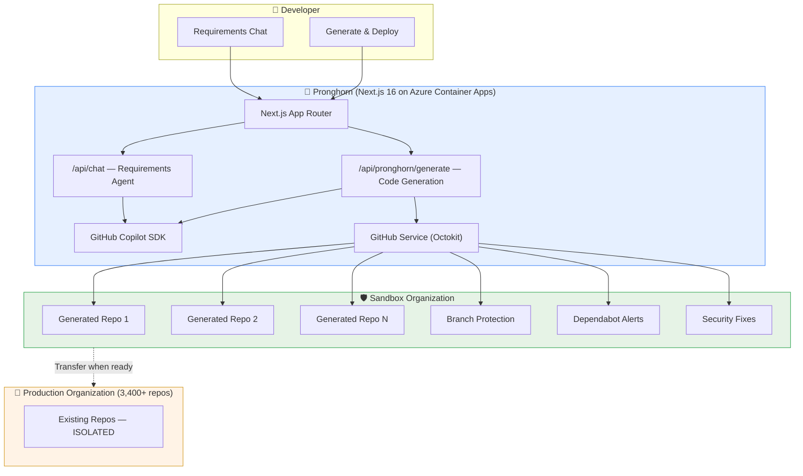

# Pronghorn 🦌

**AI-Powered Enterprise Application Generator — Built with GitHub Copilot SDK**

> Pronghorn automates greenfield application generation for enterprises. Using the GitHub Copilot SDK's agentic capabilities, it takes natural language requirements, generates production-ready code, provisions repositories in a sandboxed GitHub organization, and enforces security policies — all without touching existing production repos. Built for the Government of Alberta's enterprise modernization initiative.

---

## Problem → Solution

### The Problem

Enterprise organizations managing thousands of repositories (3,400+ in GovAlta's case) face a critical challenge: AI-driven development tools require broad repository access, creating an unacceptable "blast radius" where a bug or misconfiguration could affect the entire source code estate.

### The Solution

Pronghorn solves this with a **sandboxed organization architecture**:

1. **Isolated Sandbox**: All AI-generated repositories are created in a dedicated GitHub organization, completely separated from production repos
2. **Agentic Code Generation**: The GitHub Copilot SDK generates complete, production-ready projects from natural language requirements
3. **Automated Governance**: Branch protection, Dependabot alerts, and automated security fixes are configured at creation time
4. **Controlled Promotion**: When ready, repositories can be transferred to the production organization through established review processes

```
┌─────────────────────────────────────────────────────────────┐
│                        User / Developer                      │
│              "I need a Node.js API for inventory"            │
└──────────────────────┬──────────────────────────────────────┘
                       │
                       ▼
┌─────────────────────────────────────────────────────────────┐
│              Pronghorn Service (Next.js 16)                  │
│       Azure Container Apps — GitHub Copilot SDK              │
│                                                              │
│  ┌─────────────┐  ┌──────────────┐  ┌───────────────────┐  │
│  │ Requirements │  │ Code         │  │ Governance        │  │
│  │ Chat Agent   │  │ Generation   │  │ & Security Config │  │
│  │ (Copilot SDK)│  │ (Copilot SDK)│  │ (GitHub API)      │  │
│  └─────────────┘  └──────────────┘  └───────────────────┘  │
└──────────────────────┬──────────────────────────────────────┘
                       │
                       ▼
┌─────────────────────────────────────────────────────────────┐
│              Sandbox Organization (Isolated)                 │
│         project-pronghorn-sandbox                            │
│                                                              │
│  ┌──────────┐  ┌──────────┐  ┌──────────┐                  │
│  │ gen-app-1│  │ gen-app-2│  │ gen-app-3│  ...              │
│  │ ✅ Protected│ ✅ Protected│ ✅ Protected│                 │
│  │ 🔒 Scanned │ 🔒 Scanned │ 🔒 Scanned │                  │
│  └──────────┘  └──────────┘  └──────────┘                  │
└─────────────────────────────────────────────────────────────┘
                       │ (manual transfer when ready)
                       ▼
┌─────────────────────────────────────────────────────────────┐
│              Production Organization                         │
│         govalta-emu (3,400+ repos — UNTOUCHED)              │
└─────────────────────────────────────────────────────────────┘
```

## Architecture Diagram (Mermaid)



## Prerequisites

- **Node.js** ≥ 20
- **pnpm** (package manager)
- **GitHub CLI** (`gh`) — authenticated with `copilot` scope
- **Docker** — for containerized deployment
- **Azure Developer CLI** (`azd`) — for Azure deployment
- **GitHub Personal Access Token** — with `repo`, `admin:org` scopes for the sandbox org

## Setup

### 1. Clone and Install

```bash
git clone https://github.com/<your-username>/pronghorn-lite.git
cd pronghorn-lite
pnpm install
```

### 2. Configure Environment

```bash
# GitHub authentication for Copilot SDK
gh auth login
gh auth refresh --scopes copilot
export GITHUB_TOKEN=$(gh auth token)

# Pronghorn configuration
export PRONGHORN_SANDBOX_ORG=project-pronghorn-sandbox
export PRONGHORN_GITHUB_TOKEN=ghp_your_pat_here  # PAT with repo + admin:org scopes
```

### 3. Run Locally

```bash
pnpm dev
# App runs on http://localhost:3000
```

### 4. Verify

```bash
# Health check
curl http://localhost:3000/api/health

# Pronghorn status
curl http://localhost:3000/api/pronghorn/status
```

## Deployment (Azure)

```bash
# Login to Azure
azd auth login

# Provision and deploy
azd up
```

This deploys a single Azure Container App running the Next.js standalone build.

## Environment Variables

| Variable | Required | Description |
|----------|----------|-------------|
| `GITHUB_TOKEN` | Yes | GitHub token for Copilot SDK (injected by `gh auth token`) |
| `PRONGHORN_SANDBOX_ORG` | Yes | GitHub org where generated repos are created |
| `PRONGHORN_GITHUB_TOKEN` | No | Separate PAT for GitHub API calls (falls back to `GITHUB_TOKEN`) |
| `MODEL_PROVIDER` | No | Set to `azure` for Azure BYOM |
| `MODEL_NAME` | No | Specific model name (e.g., `o4-mini`) |

## API Endpoints

| Method | Path | Description |
|--------|------|-------------|
| `GET` | `/api/health` | Health check |
| `GET` | `/api/pronghorn/status` | Pronghorn service status |
| `POST` | `/api/chat` | Requirements chat (SSE streaming) |
| `POST` | `/api/pronghorn/generate` | Generate project + create repo (SSE streaming) |

## Tech Stack

| Layer | Technology |
|-------|-----------|
| Framework | Next.js 16 (App Router, Turbopack) |
| UI | shadcn/ui + Tailwind CSS |
| AI | GitHub Copilot SDK (`@github/copilot-sdk`) |
| GitHub API | Octokit (`@octokit/rest`) |
| Language | TypeScript (React 19) |
| Deployment | Azure Container Apps (standalone Docker) |
| IaC | Bicep |

## Responsible AI (RAI) Notes

### Transparency
- Pronghorn clearly discloses that code is AI-generated in commit messages and repo descriptions
- All generated repositories are marked with "Generated by Pronghorn" in their description
- The system prompt is visible and auditable in `AGENTS.md`

### Human Oversight
- Generated code is placed in a sandbox organization, requiring human review before promotion to production
- Branch protection rules require at least one human review before merging
- The tool assists developers — it does not replace human judgment for production decisions

### Security
- The blast radius isolation pattern ensures AI-generated code cannot affect existing production repositories
- Dependabot vulnerability alerts are automatically enabled on all generated repos
- Automated security fixes are configured where supported
- No credentials or secrets are included in generated code

### Fairness & Bias
- Code generation is based on technical requirements, not user identity
- The system follows established enterprise coding standards regardless of the requester
- Templates and patterns are consistent and auditable

### Privacy
- No user data is stored beyond the conversation session
- GitHub API calls use scoped tokens with minimum required permissions
- Data residency concerns are addressed through the sandbox organization architecture

### Limitations
- AI-generated code should always be reviewed by qualified developers before production use
- Complex architectural decisions should involve human architects
- The tool may not be aware of all organization-specific compliance requirements
- Generated code quality depends on the clarity and specificity of the requirements provided

## Project Structure

```
pronghorn-lite/
├── src/
│   ├── app/                       # Next.js 16 App Router
│   │   ├── page.tsx               # Main page — chat + generate panels
│   │   ├── layout.tsx             # Root layout (dark mode, metadata)
│   │   ├── globals.css            # Tailwind + shadcn theme tokens
│   │   └── api/
│   │       ├── health/route.ts    # Health check
│   │       ├── chat/route.ts      # Requirements chat (SSE streaming)
│   │       └── pronghorn/
│   │           ├── generate/route.ts  # Project generation pipeline (SSE)
│   │           └── status/route.ts    # Service status
│   ├── components/                # React components
│   │   ├── ui/                    # shadcn/ui primitives (button, card, badge, etc.)
│   │   ├── chat-window.tsx        # Chat message display with markdown
│   │   ├── message-input.tsx      # Chat input
│   │   └── generate-panel.tsx     # Project generation form + progress
│   └── lib/                       # Shared libraries
│       ├── copilot-client.ts      # CopilotClient singleton
│       ├── model-config.ts        # Three-path model configuration
│       ├── github-service.ts      # GitHub API wrapper (Octokit)
│       └── utils.ts               # shadcn cn() utility
├── infra/                         # Azure Bicep infrastructure
├── scripts/                       # Azure deployment hooks
├── docs/                          # Documentation (this file)
├── presentations/                 # Demo deck
├── Dockerfile                     # Next.js standalone container
├── AGENTS.md                      # Custom agent instructions
├── mcp.json                       # MCP server configuration
└── azure.yaml                     # Azure Developer CLI manifest
```

## Customer Context

This solution was designed for the **Government of Alberta (GovAlta)**, which manages 3,400+ repositories with an anticipated growth of 3,000–4,000 more. Their key concerns:

1. **Blast Radius**: Preventing AI tools from accessing all production repositories
2. **Greenfield Automation**: Accelerating new application development
3. **Governance at Scale**: Enforcing security and compliance standards automatically
4. **Data Residency**: Keeping code within Canadian boundaries (addressed by GitHub's upcoming Canada data residency)

Pronghorn demonstrates how the GitHub Copilot SDK enables enterprises to build custom agentic workflows that solve these real challenges.
